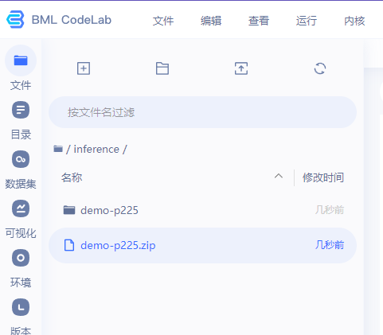
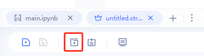
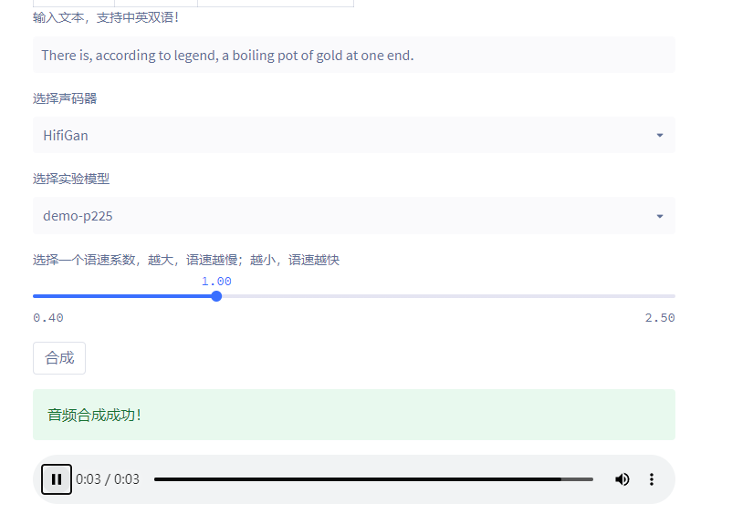

# Voice Cloning with paddlespeech in  paddle ai studio platform

“demo-p225.zip” in [this link](https://drive.google.com/drive/folders/18Ld-ZFlPzVE_JulwbcRh-szum7O2UzWK?usp=drive_link) is the model file obtained by fine-tuning the model with 10 voice samples from speaker `p225` containing watermark-0 (the first watermark in `watermarking_model/results/wmpool.txt`), using this [application](https://aistudio.baidu.com/projectdetail/5003396) based on PaddleSpeech in Paddle AI Studio. By utilizing this model in conjunction with the script, you can extract watermark-0 from the synthesized voice. 


## Upload model files
Go back to the BML CodeLab homepage, go to the inference directory. Upload the supplied model files in this directory, which are ".zip" file, and unzip it in this directory after uploading.




## Setup environment
Execute this code block in `main.ipynb`:
```
# 安装实验所需环境
!bash env.sh
!pip install typeguard==2.13
```

](Figure/setup_environment.png)


## Synthesize
Find the file  `untitled.streamlit.py` on the left hand side, double click on the file and click this button to jump to the application link.



Then select the experimental model corresponding to the model file you just uploaded, enter the text content to be synthesized, and click "Synthesize".




## Voice Cloning with new data
Since the input audio for this [application](https://aistudio.baidu.com/projectdetail/5003396) only accepts 24,000 Hz, it is necessary to use script `resample_before_syn.py` to resample the watermark audio (22,050 Hz) to 24,000 Hz before using the application. Additionally, for the generated audio, script `resample_after_syn.py` must be used to resample it back to 22,050 Hz before appling watermark extraction.