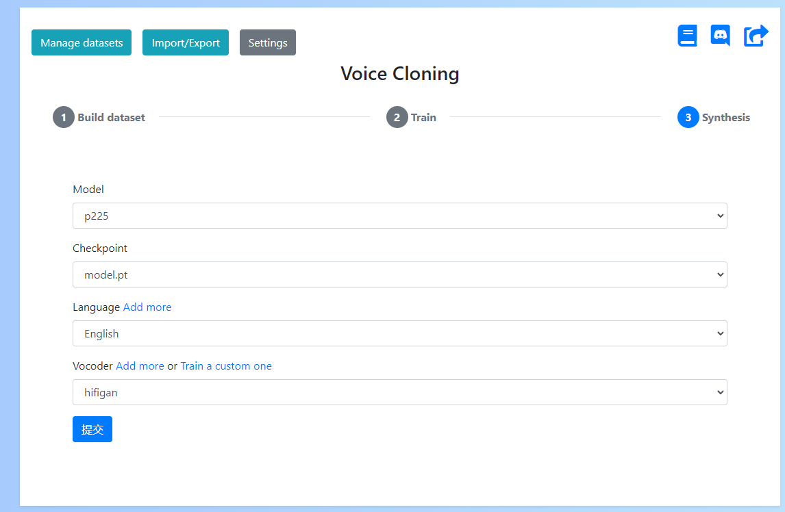
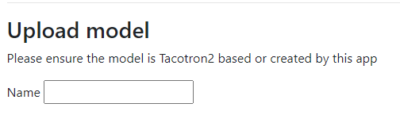
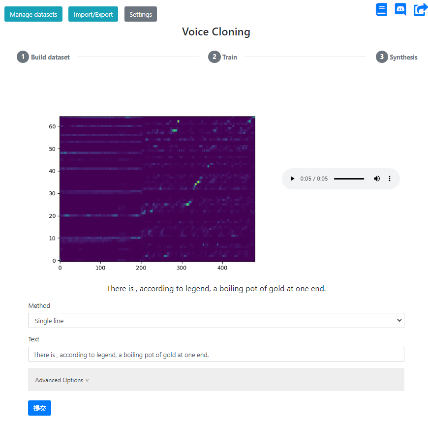

# Voice Cloning with Voice-Clone-App

We followed the guidelines provided in [this link](https://benaandrew.github.io/voice-cloning-app/) to use the Voice-Clone-App for voice cloning. 

## Version
The version of the program we used is 'Voice-Cloning-App-1.1.1-cpuonly.exe' from this [release](https://github.com/BenAAndrew/Voice-Cloning-App/releases).

## Model files
[Here](https://drive.google.com/drive/folders/15EiPom9qdZ7xIwXrj68Tldf-p6lplnL1?usp=drive_link), we offer a sample which includes a voice audio file dataset (10 voice recordings) of speaker `p225` and the corresponding clone model parameter file trained on this dataset. This dataset has been embedded with watermark-0 (the first watermark in `watermark_model/results/wmpool.txt`). Hence, when this model file is imported into the application for voice cloning, the produced clone voice will contain watermark-0.

## Synthesize
1. Upload model

2. Next, select the experimental model that corresponds to the model file you just uploaded. Enter the text you wish to synthesize and click "Synthesize".

## Voice Cloning with new data
You need to follow the instructions in [this link](https://benaandrew.github.io/Voice-Cloning-App/) to perform speech cloning. If a watermark is added to the audio data before training the voice cloning model, the synthesized speech from the generated model will contain the corresponding watermark.
